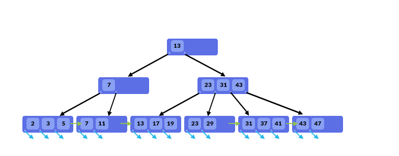

# **Index**

    Một trong những vấn đề tốn nhiều thời gian, công sức của lập trình viên đó là việc nâng cao hiệu năng (performance) cho hệ thống. Sẽ không có vấn đề gì nếu hệ thống chỉ có số người dùng và lượng dữ liệu không quá lớn, nhưng ngược lại, nếu hệ thống có sô lượng người dùng và dữ liệu rất lớn, việc tối ưu hoá các query với database sẽ là then chốt để tối ưu hiệu năng (optimize performance) cho hệ thống.

## **Index là gì?**

Index là một cấu trúc dữ liệu giúp xác định nhanh chóng các records trong table.

Nếu không có index thì SQL phải scan toàn bộ table để tìm được các records có liên quan. Dữ liệu càng lớn, tốc độ query sẽ càng chậm.

## **Ưu nhược điểm khi dùng index**

***Ưu điểm***

Ưu điểm của index là tăng tốc độ tìm kiếm records theo câu lệnh WHERE.

Không chỉ giới hạn trong câu lệnh SELECT mà với cả thao tác UPDATE hay DELETE nếu có điều kiện WHERE.

***Nhược điểm***

- Khi sử dụng index thì tốc độ của những thao tác ghi dữ liệu (Insert, Update, Delete) sẽ bị chậm đi.

- Vì ngoài việc thêm hay cập nhật thông tin thì MYSQL cũng cần cập nhật lại thông tin index của bảng tương ứng.

- Tốc độ xử lý bị chậm đi cũng tỷ lệ thuận với số lượng index được xử dụng trong bảng.

- Do vậy với những table hay có xử lý insert, update hoặc delete và cần tốc độ xử lý nhanh thì không nên được đánh index.

- Ngoài ra việc đánh index cũng sẽ tốn resource của server như thêm dung lượng cho CSDL.

## **Các loại index**

MySQL cung cấp 3 kiểu index khác nhau cho data đó là B-Tree, Hash và R-Tree index.

Do R-Tree được sử dụng cho các loại dữ liệu hình học không gian Spatial data và thường ít khi gặp phải nên bài viết này chúng ta sẽ tập chung vào 2 loại index là B-Tree và Hash.

### ***B-Tree index***

Thông thường khi nói đến index mà không chỉ rõ loại index thì mặc định là sẽ sử dụng B-Tree index.

- Dữ liệu index được tổ chức và lưu trữ theo dạng tree, tức là có root, branch, leaf.

- Cách sắp xếp không phải theo dạng cây tìm kiếm nhị phân (Binary Search Tree) vì số lá là mỗi node không bị giới hạn là 2.

- Giá trị của các node được tổ chức tăng dần từ trái qua phải.

- B-Tree index được sử dụng trong các biểu thức so sánh dạng: =, >, >=, <, <=, BETWEEN và LIKE. ⇒ Có thể tối ưu tốt cho câu lệnh ORDER BY

- Khi truy vấn dữ liệu thì CSDL sẽ không scan dữ liệu trên toàn bộ bảng để tìm dữ liệu, việc tìm kiếm trong B-Tree là 1 quá trình đệ quy, bắt đầu từ root node và tìm kiếm tới branch và leaf, đến khi tìm được tất cả dữ liệu – thỏa mãn với điều kiện truy vấn thì mới dùng lại.

### ***Hash Index***

Hash index dựa trên giải thuật Hash Function (hàm băm). Tương ứng với mỗi khối dữ liệu (index) sẽ sinh ra một bucket key(giá trị băm) để phân biệt.

- Khác với B-Tree, thì Hash index chỉ nên sử dụng trong các biểu thức toán tử là = và <>. Không sử dụng cho toán từ tìm kiếm 1 khoảng giá trị như > hay < .

- Không thể tối ưu hóa toán tử ORDER BY bằng việc sử dụng Hash index bởi vì nó không thể tìm kiếm được phần từ tiếp theo trong Order.

- Hash có tốc độ nhanh hơn kiểu B-Tree.

## **Các kiểu index tương ứng với Storage Engine**

Việc chọn index theo kiểu B-Tree hay Hash ngoài yếu tố về mục đích sử dụng index thì nó còn phụ thuộc vào việc Storage Engine có hỗ trợ loại index đó hay không.

| **Storage Engine** | **Index support** |
|--------------------|-------------------|
| InnoDB             | BTREE             |
| MyISAM             | BTREE             |
| MEMORY/HEAP        | HASH, BTREE       |
| NDB                | HASH, BTREE       |

