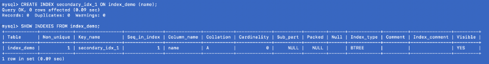
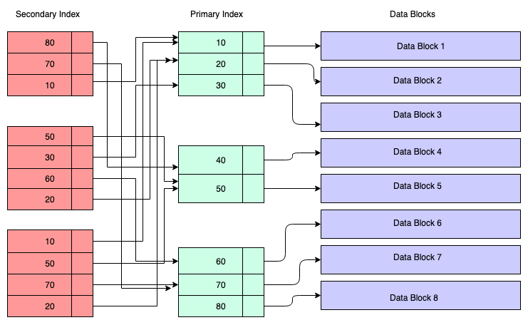

# **Đi sâu hơn về INDEX trong Database**

Hiệu suất là điều cực kỳ quan trọng trong nhiều sản phẩm tiêu dùng như: thương mại điện tử, hệ thống thanh toán, trò chơi, ứng dụng giao thông, v.v. Mặc dù cơ sở dữ liệu được tối ưu hóa nội bộ thông qua nhiều cơ chế để đáp ứng các yêu cầu về hiệu suất của chúng trong thế giới hiện đại, nhưng cũng phụ thuộc rất nhiều vào nhà phát triển ứng dụng — xét cho cùng, chỉ nhà phát triển mới biết ứng dụng phải thực hiện những truy vấn nào.

Các nhà phát triển xử lý cơ sở dữ liệu quan hệ (relational databases) đã từng sử dụng hoặc ít nhất là đã nghe nói về lập index và đó là một khái niệm rất phổ biến trong thế giới cơ sở dữ liệu. Tuy nhiên, phần quan trọng nhất là phải hiểu những cái gì cần lập index & làm cách nào để lập index giúp tốc độ truy vấn tăng. Để làm được điều đó, bạn cần phải hiểu cách mà bạn sẽ truy vấn các bảng trong cơ sở dữ liệu của mình. Chỉ có thể tạo một index phù hợp khi bạn biết chính xác bạn phải truy vấn dữ liệu như thế nào và dữ liệu được trả về ra sao.

Theo thuật ngữ đơn giản, một index ánh xạ các khóa tìm kiếm tới dữ liệu tương ứng trên đĩa bằng cách sử dụng các cấu trúc dữ liệu trong bộ nhớ và trên đĩa khác nhau. Index được sử dụng để tăng tốc độ tìm kiếm bằng cách giảm số lượng record không liên quan tới câu truy vấn.

>record: hiểu nôm na là một mẩu dữ liệu trong database.

Khi sử dụng mệnh đề `WHERE` để truy vấn dữ liệu, cơ sở dữ liệu sẽ truy xuất và lọc dữ liệu từ các bảng dựa trên các cột đó. Nếu bạn không tạo index, cơ sở dữ liệu sẽ quét tất cả các hàng, lọc ra các hàng phù hợp và trả về kết quả. Với hàng triệu record, thao tác quét này có thể mất nhiều giây và thời gian phản hồi cao này khiến các API & ứng dụng chậm hơn và không sử dụng được.

>API: là viết tắt của Application Programming Interface – phương thức trung gian kết nối các ứng dụng và thư viện khác nhau. </br>
Nó cung cấp khả năng truy xuất đến một tập các hàm hay dùng, từ đó có thể trao đổi dữ liệu giữa các ứng dụng.

Hãy xem một ví dụ -

Tạo một bảng có tên `index_demo` với cú pháp sau:

```sql
CREATE TABLE index_demo ( 
    name VARCHAR(20) NOT NULL, 
    age INT, 
    pan_no VARCHAR(20), 
    phone_no VARCHAR(20) 
);
```

Bây giờ Chèn một số dữ liệu ngẫu nhiên vào bảng, bảng của ta có 5 hàng trông giống như sau:


Vì chưa tạo bất kỳ index nào trên bảng này nên khi kiểm tra bằng lệnh: `SHOW INDEX`. Nó trả về 0 kết quả.

Bây giờ, nếu chúng ta chạy một truy vấn `SELECT` đơn giản, vì không có index do người dùng xác định, truy vấn sẽ quét toàn bộ bảng để tìm ra kết quả:

```sql
EXPLAIN SELECT * FROM index_demo WHERE name = 'alex';
```


`EXPLAIN` hiển thị cách công cụ truy vấn lập kế hoạch thực hiện truy vấn. Trong ảnh chụp màn hình ở trên, bạn có thể thấy rằng cột `rows` trả về `5` (tức là có 5 record trong bảng) và `possible_keys` trả về `null`. `possible_keys` đại diện cho tất cả các index có sẵn có thể được sử dụng, còn cột `key` biểu thị loại index nào được sử dụng trong truy vấn này. Nhưng hiện tại không có index nào trong bảng nên 2 cột này đều trả về `null`.

## **Primary Key**

Truy vấn trên rất kém hiệu quả. Hãy tối ưu hóa truy vấn này. Ta sẽ chuyển cột `phone_no` thành `PRIMARY KEY` với giả định rằng không hai tài khoản có cùng một số điện thoại trong hệ thống của chúng ta. Nhưng trước tiên cần phải lưu ý những điều sau:

- primary key phải là một phần của nhiều truy vấn quan trọng trong ứng dụng của bạn.

- primary key là một ràng buộc xác định mỗi hàng trong một bảng là duy nhất. Nếu nhiều cột là một phần của primary key, thì sự kết hợp đó phải là duy nhất cho mỗi hàng.

- primary key phải là Non-null. Một cột có thể chứa giá trị rỗng không thể trờ thành một primary key. Theo tiêu chuẩn ANSI SQL, các primary key phải tương đương với nhau và bạn chắc chắn có thể biết liệu giá trị của cột primary key này lớn hơn, nhỏ hơn hay bằng giá trị của một cột khoá chính khác. Vì `NULL` có nghĩa là một giá trị không xác định (*undefined*) trong các tiêu chuẩn SQL, nên bạn không thể so sánh một cách xác định `NULL` với bất kỳ giá trị nào khác, vì vậy `NULL` về mặt logic là không được phép.

- Loại primary key lý tưởng phải là một số như `INT` hoặc `BIGINT` vì so sánh số nguyên nhanh hơn, nên việc duyệt qua index sẽ rất nhanh.

Thông thường, chúng ta xác định trường `id` là `AUTO INCREMENT` trong bảng và sử dụng trường đó làm primary key, nhưng việc lựa chọn primary key là phụ thuộc vào nhà phát triển.

## **Điều gì sẽ xảy ra nếu bạn không tự tạo bất kỳ primary key nào?**

Không bắt buộc phải tự tạo primary key. Nếu bạn chưa xác định bất kỳ primary key nào, InnoDB sẽ ngầm tạo một khóa cho bạn, vì InnoDB theo thiết kế phải có một primary key trong mỗi bảng. Vậy nên sau khi bạn tạo primary key cho bảng đó, InnoDB sẽ xóa primary key được xác định tự động trước đó.

Vì hiện tại chúng ta không có bất kỳ primary key nào được xác định, hãy xem InnoDB theo mặc định sẽ tạo ra những gì cho chúng ta:

```sql
SHOW EXTENDED INDEX FROM index_demo;
```


`EXTENDED` hiển thị tất cả các chỉ số mà người dùng không thể sử dụng được, nhưng được hoàn toàn quản lý bởi MySQL.

Ở đây chúng ta thấy rằng MySQL đã xác định một index tổng hợp (chúng ta sẽ thảo luận về các index tổng hợp sau) trên `DB_ROW_ID` , `DB_TRX_ID`, `DB_ROLL_PTR` và tất cả các cột được xác định trong bảng. Trong trường hợp không có primary key do người dùng xác định, index này được sử dụng để tìm các record duy nhất.

## **Sự khác biệt giữa key và index là gì?**

Mặc dù các thuật ngữ `key` và `index` được sử dụng thay thế cho nhau, nhưng `key` có nghĩa là một ràng buộc áp đặt lên hành vi của cột, trong trường hợp này primary key không được phép rỗng, là trường dùng để xác định mỗi hàng. Còn `index` là một cấu trúc dữ liệu đặc biệt giúp tạo ra các điều kiện trong mệnh đề `WHERE` để tìm kiếm dữ liệu trên bảng.

Bây giờ, hãy tạo index chính trên `phone_no` và kiểm tra index đã tạo:

```sql
ALTER TABLE index_demo ADD PRIMARY KEY (phone_no);
SHOW INDEXES FROM index_demo;
```

Lưu ý rằng không thể sử dụng lệnh `CREATE INDEX` để tạo primary index, nhưng lệnh `ALTER TABLE` thì có thể.


Trong ảnh chụp ở trên, chúng ta thấy rằng một primary index được tạo trên cột `phone_no`. Các cột còn lại trong hình ảnh được mô tả như sau:

`Table`: Bảng mà index được tạo.

`Non_unique`: Nếu giá trị là 1, index không phải là duy nhất, nếu giá trị là 0, index là duy nhất.

`Key_name`: Tên của index được tạo. Tên của primary index luôn là `PRIMARY` trong MySQL, bất kể bạn có nhập bất kỳ tên gì cho index hay không.

`Seq_in_index`: Số thứ tự của cột trong index. Nếu nhiều cột là một phần của index, số thứ tự sẽ được chỉ định dựa trên cách các cột được sắp xếp trong thời gian tạo index. Số thứ tự bắt đầu từ 1.

`Collation`: cách cột được sắp xếp trong index. `A` có nghĩa là tăng dần, `D` có nghĩa là giảm dần, `NULL` có nghĩa là không được sắp xếp.

`Cardinality`: là số ước tính tổng số lượng các giá trị duy nhất trong index. Càng nhiều cardinality có nghĩa là cơ hội cao hơn mà trình tối ưu hóa truy vấn sẽ chọn index cho các truy vấn.

`Sub_part` : Tiền tố index. Có giá trị là `NULL` nếu toàn bộ cột được lập index. Mặt khác, nó hiển thị số byte được lập index trong trường hợp chỉ có một số cột lập index.

`Packed`: Cho biết khóa được đóng gói như thế nào; NULL nếu không có.

`Null`: `YES` nếu cột có thể chứa giá trị `NULL` hoặc sẽ được để trống nếu cột không thể chứa giá trị `NULL`.

`Index_type`: Cho biết cấu trúc dữ liệu lập index nào được sử dụng cho index này. Một số loại cấu trúc có thể là — `BTREE`, `HASH`, `RTREE` hoặc `FULLTEXT`.

`Comment`: Thông tin về index không được mô tả trong cột riêng của nó.

`Index_comment`: Nhận xét cho index được chỉ định khi bạn tạo index bằng thuộc tính `COMMENT`.

Bây giờ, hãy xem liệu index này có làm giảm số hàng sẽ được tìm kiếm cho một `phone_no` nhất định trong mệnh đề WHERE của truy vấn hay không.

```sql
EXPLAIN SELECT * FROM index_demo WHERE phone_no = '9281072002';
```


Trong ảnh, cột `rows` chỉ trả về `1`, cả `possible_keys` và `key` đều trả về `PRIMARY`, có nghĩa là bằng cách sử dụng primary index có tên là `PRIMARY` (tên được gán tự động khi bạn tạo primary key), trình tối ưu hóa truy vấn chỉ cần truy cập trực tiếp vào record và nạp nó. Đây chính xác là mục đích của một index - để giảm phạm vi tìm kiếm và tài nguyên sử dụng.

## **Clustered Index**

Một clustered index được sắp xếp với dữ liệu trong cùng một bảng hoặc cùng một tệp đĩa. Vì index và dữ liệu nằm cùng nhau, bạn có thể coi clustered index là B-Tree index có các nút lá là các block dữ liệu thực tế trên đĩa. Loại index này tổ chức vật lý dữ liệu trên đĩa theo thứ tự logic của khóa index.

## **Tổ chức dữ liệu vật lý nghĩa là gì?**

Về mặt vật lý, dữ liệu được tổ chức trên đĩa qua hàng nghìn hoặc hàng triệu block đĩa/dữ liệu. Các block dữ liệu vật lý luôn được HĐH di chuyển khắp nơi bất cứ khi nào cần thiết. Tuy nhiên một hệ thống cơ sở dữ liệu không thể làm như vậy, nó chỉ có thể quản lý dữ liệu trong một block dữ liệu, các record có thể được lưu trữ hoặc quản lý theo thứ tự logic của khóa index.


- Hình chữ nhật lớn màu vàng nhạt đại diện cho block đĩa/block dữ liệu.

- Các hình chữ nhật màu xanh dương nhạt đại diện cho dữ liệu được lưu trữ dưới dạng các hàng bên trong block đó.

- Khu vực chân trang biểu thị index của block, nơi các hình chữ nhật nhỏ màu đỏ nhạt nằm theo thứ tự được sắp xếp một cách cụ thể, nó là những con trỏ trỏ đến vị trí của record.

Các record được lưu trữ trên block đĩa theo thứ tự tùy ý. Bất cứ khi nào các record mới được thêm vào, chúng sẽ được thêm vào không gian có sẵn tiếp theo, còn khi record được cập nhật, hệ điều hành sẽ quyết định xem record đó vẫn có thể vừa với vị trí cũ hay phải được phân bổ một vị trí mới.

Vì vậy, vị trí của các record hoàn toàn được hệ điều hành quản lý và các record đó độc lập với nhau. Để tìm nạp các record chỉ cần sử dụng các con trỏ ở phần chân trang. Mỗi khi một record được thay đổi hoặc tạo ra, index sẽ được điều chỉnh.

Theo cách này, bạn thực sự không cần quan tâm đến việc chức record vật lý theo một thứ tự nhất định, thay vào đó, một phần index nhỏ được duy trì theo thứ tự đó và việc tìm nạp hoặc duy trì record trở nên rất dễ dàng.

## **Ưu điểm của Clustered Index**

Sắp xếp thứ tự và việc dữ liệu nằm cùng một vị trí như vậy thực sự làm cho clustered index nhanh hơn. Khi dữ liệu được tìm nạp từ đĩa, toàn bộ block chứa dữ liệu sẽ được hệ thống đọc đến, bởi hệ thống ổ đĩa của chúng ta đọc và ghi dữ liệu theo block. Vì vậy, trong trường hợp truy vấn phạm vi, dữ liệu đã được sắp xếp sẽ lưu tạm thời vào bộ nhớ đệm. Giả sử bạn thực hiện truy vấn sau:

```sql
SELECT * FROM index_demo WHERE phone_no > '9010000000' AND phone_no < '9020000000'
```

Một block dữ liệu được tìm và nạp vào trong bộ nhớ (ram) khi truy vấn được thực hiện. Giả sử block dữ liệu chứa `phone_no` có giá trị trong phạm vi từ `9010000000` đến `9020000000`. Chẳng hạn như bây giờ bạn cần thực hiện một truy vấn tiếp lấy dữ liệu có giá trị trong phạm vi từ `9015000000` đến `9019000000`, thì bạn không cần phải tìm nạp thêm bất kỳ block nào từ đĩa nữa vì nó đã có sẵn ở trên bộ nhớ hiện tại, do đó, `clustered_index` cải thiện hiệu xuất bằng cách sắp xếp dữ liệu liên quan càng nhiều càng tốt trong cùng một block dữ liệu.

Vì vậy, nếu bạn hiểu rõ về primary key và các truy vấn của bạn dựa trên primary key, thì hiệu suất sẽ cực kỳ nhanh.

## **Các ràng buộc của Clustered Index**

Vì index được nhóm tác động đến tổ chức vật lý của dữ liệu nên chỉ có thể có một clustered index trên mỗi bảng.

## **Mối quan hệ giữa Primary Key và Clustered Index**

Bạn không thể tạo clustered index theo cách thủ công bằng InnoDB trong MySQL. MySQL chọn nó cho bạn. Nhưng nó chọn như thế nào? Các đoạn trích sau đây là từ tài liệu MySQL:

> Khi bạn xác định một `PRIMARY KEY` trên bảng của mình, `InnoDB` sẽ sử dụng nó làm clustered index. Xác định primary key cho mỗi bảng mà bạn tạo. Nếu một hoặc nhiều cột trong bảng có thể chứa giá trị trùng lặp, hãy thêm một cột mới có thuộc tính là auto-increment, thuộc tính ngày sẽ tự động điền vào cột một giá trị riêng biệt với càng hàng khác khi có dữ liệu mới được thêm vào. </br></br>
Nếu bạn không xác định `PRIMARY KEY` cho bảng của mình, MySQL sẽ tự định vị index `UNIQUE` đầu tiên mà nó tìm thấy có thuộc tính `NOT NULL` và `InnoDB` sẽ sử dụng cột đó làm clustered index. </br></br>
Nếu bảng không có `PRIMARY KEY` hoặc index `UNIQUE` phù hợp, `InnoDB` sẽ tự tạo một clustered index ẩn có tên `GEN_CLUST_INDEX` trên một cột tổng hợp chứa các giá trị ID hàng. `InnoDB` sẽ gán cho các hàng một ID và sắp xếp chúng. ID hàng là một trường 6 byte tăng tịnh tiến khi các hàng mới được chèn vào. Do đó, các hàng được sắp xếp theo ID theo thứ tự tăng dần.

Nói tóm lại, công cụ InnoDB của MySQL quản lý primary index dưới dạng clustered index để cải thiện hiệu suất, do đó, primary key và record trên đĩa được nhóm lại với nhau.

## **Cấu trúc của Primary key (clustered) Index**

Một index thường được duy trì dưới dạng B+ Tree trên đĩa và trong bộ nhớ, bất kỳ index nào cũng được lưu trữ trong các block trên đĩa. Các block này được gọi là block index. Các mục trong block index luôn được sắp xếp theo khóa index/search. block chỉ số lá của index chứa bộ định vị hàng. Đối với index chính, bộ định vị hàng đề cập đến địa chỉ ảo của vị trí vật lý tương ứng của các block dữ liệu trên đĩa nơi các hàng cư trú được sắp xếp theo khóa index.

Trong sơ đồ sau, các hình chữ nhật bên trái biểu thị các block index cấp độ lá và các hình chữ nhật bên phải biểu thị các block dữ liệu. Về mặt logic, các block dữ liệu có vẻ được căn chỉnh theo thứ tự đã sắp xếp, nhưng như đã mô tả trước đó, trong thực chúng có thể nằm rải rác trong block.


## **Có thể tạo index trên cột không phải khoá chính?**

Mặc dù một primary index sẽ được tạo tự động, tuy nhiên không thực sự bắt buộc phải tạo index trên  primary key - primary index có thể được tạo trên bất kỳ cột nào. Chẳng qua khi được tạo trên primary key, tất cả các giá trị phải là UNIQUE, còn trong trường hợp khác, chỉ mục chính có thể có giá trị trùng lặp.

## **Có thể xóa primary key không?**

Có thể. Tuy nhiên khi bạn xóa một primary key, clustered index có liên quan cũng như thuộc tính UNIQUE của cột đó cũng sẽ mất theo.

```sql
ALTER TABLE `index_demo` DROP PRIMARY KEY;

- Nếu primary key không tồn tại, bạn sẽ nhận được lỗi sau:

"ERROR 1091 (42000): Can't DROP 'PRIMARY'; check that column/key exists"
```

## **Ưu điểm của Primary Index**

- Các truy vấn phạm vi dựa trên primary index rất hiệu quả. Vì primary index được gộp nhóm lại và các record được sắp xếp theo thứ tự, nên toàn bộ dữ liệu liên quan đến câu truy vấn sẽ được đưa vào một block đĩa. Vì vậy, vị trí của dữ liệu trong block đó có thể được cung cấp bởi primary index.

- Bất kỳ truy vấn nào sử dụng primary key đều rất nhanh vì có thể sử dụng Binary Search do dữ liệu đã được sắp xếp sẵn.

## **Nhược điểm của Primary Index**

Primary index chứa tham chiếu trực tiếp đến địa chỉ block dữ liệu thông qua không gian địa chỉ ảo và các block đĩa được tổ chức vật lý theo thứ tự của khóa index, nên mỗi khi HĐH thực hiện phân tách một số trang đĩa do hoạt động DML như INSERT/UPDATE/DELETE, primary index cũng cần được cập nhật, mà các index được sắp xếp một cách tuần tự, nên tốc độ thực hiện các hoạt động DML sẽ bị giảm xuống vì primary index cần sắp xếp lại index cho các record.

## **Secondary Index**

Bất kỳ index nào khác ngoài clustered index được gọi là secondary index. Các secondary index không ảnh hưởng đến các vị trí lưu trữ vật lý không giống như các index chính.

## **Khi nào bạn cần secondary index**

Bạn có thể có một số trường hợp sử dụng trong ứng dụng của mình mà bạn không truy vấn cơ sở dữ liệu bằng primary key. Trong ví dụ của chúng ta, `phone_no` là primary key nhưng chúng ta có thể cần truy vấn cơ sở dữ liệu bằng `pan_no` hoặc `name`. Trong những trường hợp như vậy, bạn cần secondary index trên các cột này nếu tần suất của các truy vấn đó rất cao.

## **Làm cách nào để tạo secondary index trong MySQL?**

Lệnh sau tạo một secondary index trong cột `name` trong bảng `index_demo`.

```sql
CREATE INDEX secondary_idx_1 ON index_demo (name);
```



## **Cấu trúc của secondary index**

Trong sơ đồ bên dưới, các hình chữ nhật màu đỏ đại diện cho các block secondary index. Secondary index cũng được duy trì trong B+ Tree và nó được sắp xếp theo khóa mà index được tạo. Các nút lá chứa một bản sao khóa của dữ liệu tương ứng trong primary index.

Vì vậy, để dễ hiểu, bạn có thể cho rằng secondary index có tham chiếu đến địa chỉ của primary key, mặc dù thực tế không phải vậy. Truy xuất dữ liệu thông qua secondary index có nghĩa là bạn phải duyệt qua hai cây B+: một là chính cây B+ chứa secondary index và cây còn lại là cây B+ primary index.



## **Ưu điểm của Secondary Index**

Về mặt logic, bạn có thể tạo bao nhiêu secondary index tùy ý. Nhưng trên thực tế việc tạo ra bao nhiêu index thực sự cần phải được cân nhắc vì mỗi index có một hạn chế riêng.

## **Nhược điểm của Secondary Index**

Với các thao tác DML như DELETE/INSERT, secondary index cũng cần được cập nhật để có thể xóa/chèn bản sao của cột primary key. Trong những trường hợp như vậy, sự tồn tại của nhiều secondary index có thể tạo ra vấn đề.

Ngoài ra, nếu một primary key quá lớn, ví như một URL, vì các secondary index chứa một bản sao của giá trị cột primary key, nên nó có thể không hiệu quả về mặt lưu trữ. Nhiều khóa phụ hơn có nghĩa là số lượng bản sao trùng lặp của giá trị cột primary key lớn hơn, do đó, nhiều bộ nhớ hơn trong trường hợp primary key lớn. Ngoài ra, primary key lưu trữ các khóa, vì vậy hiệu quả tổng hợp về lưu trữ sẽ rất cao.
