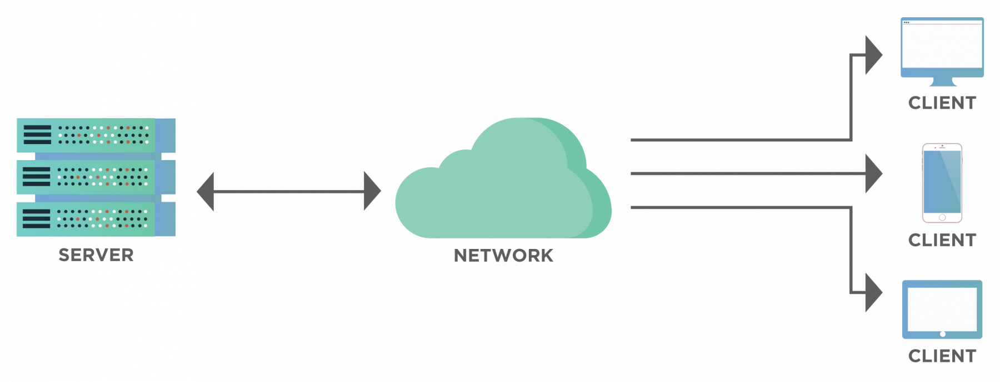
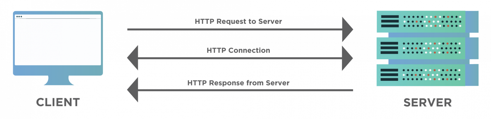

# **Client Server**

## **Nội dung chính**

* *[Client Server architecture](#kiến-trúc-client-server-là-gì)*

* *[Client là gì?](#client-là-gì)*

* [Server là gì?](#server-là-gì)

* [Cách kiến trúc Client Server hoạt động](#cách-kiến-trúc-client-server-hoạt-động)

* [Các loại kiến trúc Client Server](#các-loại-kiến-trúc-client-server)

## **Kiến trúc Client Server là gì?**

Client server là mô hình mạng máy tính gồm có 2 thành phần chính đó là máy khách (client) và máy chủ (server). Server chính là nơi giúp lưu trữ tài nguyên cũng như cài đặt các chương trình dịch vụ theo đúng như yêu cầu của client. Ngược lại, Client bao gồm máy tính cũng như các loại thiết bị điện tử nói chung sẽ tiến hành gửi yêu cầu đến server.

Mô hình mạng Client Server sẽ cho phép mạng tập trung các ứng dụng có cùng chức năng tại một hoặc nhiều dịch vụ file chuyên dụng. Chúng sẽ trở thành trung tâm của hệ thống. Hệ điều hành của mô hình Client server sẽ cho phép người dùng chia sẻ đồng thời cùng một loại tài nguyên mà không giới hạn vị trí địa lý.

## **Client là gì?**

Client chính là khách hàng sử dụng dịch vụ. Nó có thể là một tổ chức hay cá nhân cụ thể nào đó. Và khi khái niệm này được sử dụng trong lĩnh vực kỹ thuật số thì cũng mang ý nghĩa tương tự như vậy. Trong Client Server thì Client chính là một máy tính (Host). Chúng có khả năng nhận thông tin (văn bản, hình ảnh, video...) từ nhà cung cấp và sử dụng dịch vụ cụ thể (Server).

## **Server là gì?**

Server là từ dùng để nói về một máy chủ hoặc một phương tiện được sử dụng để phục vụ các dịch vụ nào đó. Khi khái niệm này được sử dụng trong lĩnh vực công nghệ thì Server là một máy tính từ xa. Chúng có chức năng là cung cấp các thông tin (dữ liệu) cho một dịch vụ cụ thể nào đó hoặc quyền truy cập đối với dịch vụ.

> Hiểu một cách đơn giản thì Client là nguồn yêu cầu và Server phải phục vụ theo yêu cầu đó.

Một số Server phổ biến:

* **Database Server (Máy chủ cơ sở dữ liệu)**: được sử dụng để duy trì và chia sẻ cơ sở dữ liệu qua mạng (ví dụ: ...).

* **Application Server (Máy chủ ứng dụng)**: được sử dụng để lưu trữ các ứng dụng bên trong trình duyệt web cho phép sử dụng chúng mà không cần cài đặt về máy (ví dụ: office 365 online...).

* **Mail Server**: được sử dụng để liên lạc qua email (ví dụ: Google Email...).

* **Web Server (Máy chủ Web)**: được sử dụng để lưu trữ các trang web vì có thể có web trên toàn thế giới.

* **Gamming Server (Máy chủ chơi game)**: được sử dụng để chơi các trò chơi nhiều người chơi.

* **File Server (Máy chủ tệp)**: được sử dụng để chia sẻ tệp và thư mục qua mạng.

Client và Server không nhất thiết phải ở cùng một vị trí. Chúng có thể được đặt ở các vị trí khác nhau hoặc có thể nằm dưới dạng các quy trình khác nhau trên cùng một máy tính. Chúng được kết nối qua Web và tương tác qua giao thức [HTTP](./HTTP.md). Một Server có thể nhận nhiều yêu cầu (request) từ Client, và ngược lại, một Client có thể yêu cầu đến nhiều Server.

## **Cách kiến trúc Client Server hoạt động**

Như thể hiện trong sơ đồ, một Server có thể phục vụ các yêu cầu của nhiều Client (có thể lên đến hàng triệu, hàng tỷ yêu cầu). Tương tự, một Client có thể yêu cầu dữ liệu từ nhiều Server khác nhau. Hãy xem xét một ví dụ về Google. Ở đây, Google đóng vai trò là Server và những người dùng (có thể chính là bạn) ở các vị trí khác nhau trên thế giới đóng vai trò là một Client.

Vậy nó hoạt động thế nào? Hãy xem phầm bên dưới:

* Giao thức [HTTP](./HTTP.md) (sẽ nói chi tiết sau bài này) giúp thiết lập kết nối giữa Client và Server.

* Client gửi yêu cầu dưới dạng [XML](https://topdev.vn/blog/xml-la-gi/) hoặc [JSON](https://topdev.vn/blog/json-la-gi/) qua kết nối đang hoạt động. Client và Server đều hiểu được yêu cầu này.

* Khi nhận được yêu cầu của Client, Server sẽ tìm kiếm dữ liệu được yêu cầu và gửi lại các chi tiết liên quan dưới dạng phản hồi (response) ở cùng định dạng mà yêu cầu đã được nhận (hiểu nôm na là Client yêu cầu gì Server sẽ phản hồi lại cái đó, ví dụ: Client yêu cầu đăng nhập, Server sẽ chuyển đến trang đăng nhập và hiển thị giao diện đăng nhập cho Client).

Sơ đồ trên cho thấy quá trình giao tiếp giữa máy khách và máy chủ. Máy khách gửi một yêu cầu HTTP, máy chủ sẽ gửi một phản hồi HTTP. Chúng ta hãy xem xét một ví dụ để hiểu thêm về nó.

Giả sử rằng bạn cần đi mua sắm từ nhà đến một cửa hàng bên kia đường, trên cửa hàng có một biển hiệu ghi tên và địa chỉ. Bạn có thể đi bằng xe đạp để đến cửa hàng, sau khi vào cửa hàng, bạn yêu cầu những món hàng mà bạn cần với nhân viên bán hàng. Nếu sản phẩm bạn yêu cầu có trong cửa hàng, nhân viên sẽ mang đến cho bạn, ngược lại nhân viên sẽ thông báo cho bạn rằng hàng đã hết.

Bây giờ, bạn có thể liên kết ví dụ trên với việc truy cập đến một trang web, con đường giữa nhà bạn và cửa hàng là kết nối internet. Phương thức di chuyển mà bạn đã chọn để đi là TCP / IP, xác định giao thức truyền thông để dữ liệu di chuyển qua internet. Địa chỉ của shop là DNS (Domain Name Server) của website. Ngôn ngữ giao tiếp của bạn với người bán hàng là HTTP (Giao thức truyền siêu văn bản) xác định ngôn ngữ tương tác giữa máy khách và máy chủ. Yêu cầu đặt hàng của bạn là yêu cầu HTTP và cập nhật về tính sẵn có của mặt hàng là phản hồi HTTP.

Khi trình duyệt web gửi một yêu cầu đến máy chủ với DNS của trang web và máy chủ chấp thuận yêu cầu của khách hàng, nó sẽ gửi một thông báo thành công 200 OK. Thông báo này có nghĩa là máy chủ đã định vị trang web và nó sẽ gửi lại các tệp trang web dưới dạng phần nhỏ dữ liệu cho trình duyệt. Sau đó, trình duyệt sẽ thu thập và lắp ráp các phần nhỏ này lại để tạo thành trang web hoàn chỉnh và hiển thị cho chúng ta.

## **Các loại kiến trúc Client Server**

Kiến trúc Client-Server có bốn kiểu sau:

* Kiến trúc 1 tầng (1-tier).

* Kiến trúc 2 tầng (2-tier).

* Kiến trúc 3 tầng (3-tier).

* Kiến trúc N tầng (N-tier).

### **Kiến trúc 1 tầng**

Trong kiến ​​trúc 1 tầng, logic nghiệp vụ, logic dữ liệu và giao diện người dùng đều nằm trên cùng một máy. Môi trường đơn giản và rẻ vì máy khách và máy chủ nằm trên cùng một hệ thống, nhưng sự khác biệt về dữ liệu dẫn đến việc lặp lại công việc. Các hệ thống như vậy lưu trữ dữ liệu trong một tệp cục bộ hoặc một trình điều khiển được chia sẻ. Ví dụ về các ứng dụng 1 tầng là trình phát MP3 hoặc tệp MS Office.

### **Kiến trúc 2 tầng**

Kiến trúc 2 tầng cung cấp môi trường tốt nhất về mặt hiệu suất do không có bất kỳ máy chủ can thiệp nào. Giao diện người dùng nằm ở phía máy khách trong khi cơ sở dữ liệu ở phía máy chủ. Cơ sở dữ liệu và logic nghiệp vụ có thể được lưu trữ ở máy khách hoặc máy chủ, nhưng chúng phải không thay đổi.

### **Kiến trúc 3 tầng**

Kiến trúc 3 tầng liên quan đến một phần mềm trung gian được sử dụng để tương tác giữa máy khách và máy chủ. Mặc dù nó đắt tiền nhưng rất dễ sử dụng. Phần mềm trung gian cải thiện hiệu suất và tính linh hoạt. Nó lưu trữ business và data logic.

Ba lớp trong kiến ​​trúc 3 tầng là:

* Presentation Layer (Client tier)
* Application Layer (Business tier)
* Database Layer (Data tier)

Hầu hết tất cả các ứng dụng web đều là ví dụ về kiến ​​trúc 3 tầng.

### **Kiến trúc N tầng**

Kiến trúc n-tier là dạng thu nhỏ của kiến ​​trúc 3 tầng. Trong môi trường như vậy, chức năng xử lý, quản lý dữ liệu và trình bày được tách biệt trong các lớp khác nhau. Sự cách ly giúp hệ thống dễ dàng quản lý và bảo trì. Đây cũng được gọi là kiến ​​trúc nhiều tầng.

> Tiếp theo là gì? Xem [HTTP](./HTTP.md).
