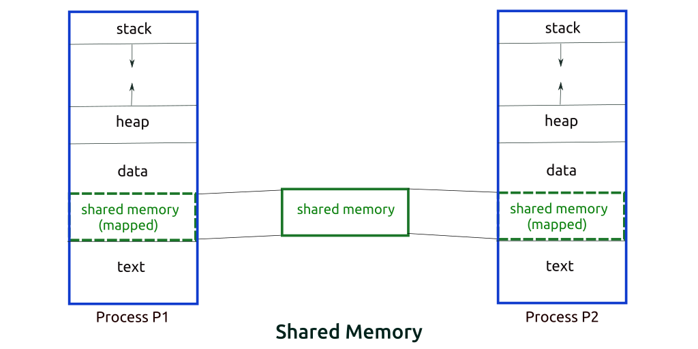

# **Inter Process Communication (IPC)**

Trong hệ thống process của máy tính thì sẽ có hai loại: **Independent** (process độc lập) và **Cooporating** (process hợp tác). Một process độc lập sẽ hoạt động mà không bị ảnh hưởng bởi các process khác, tức là nó có thể luôn đảm bảo được công việc mà nó thực thi. Ngược lại, khi process hợp tác hoạt động, nó có thể bị ảnh hưởng bởi các process liên quan, thậm chí có thể gây gián đoạn vô thời hạn. Nếu chỉ nhìn qua khái niệm, ta có thể thấy rõ ràng process độc lập sẽ thực thi hiệu quả hơn, do nó không phải phụ thuộc vào cái gì ngoài bản thân tập lệnh của nó. Tuy nhiên, trong thực tế thì các process hợp tác mới thực sự là cái đem lại hiệu quả cao. Do các vấn đề liên quan đến tốc độ, sự thuận tiện và tính mô đun hóa mà process hợp tác sẽ đem lại hiệu quả tốt hơn. Khái niệm **Inter-Process Communication** (IPC) ra đời như là một cơ chế cho phép các process giao tiếp với nhau và đồng bộ hóa các hành động của chúng. Quá trình giao tiếp có thể giúp các process biết được trình trạng hoạt động, cũng như tình trạng sử dụng tài nguyên để phân bổ thời gian hợp lý. Các process có thể giao tiếp với nhau theo hai cách: `Shared Memory`(chia sẻ bộ nhớ) và `Message Parsing` (phân tích thông điệp).

Một hệ điều hành có thể thực hiện cả hai cách này. Giao tiếp giữa các process sử dụng **Shared Memory** yêu cầu các process chia sẻ một số biến và nó hoàn toàn phụ thuộc vào cách lập trình viên sẽ thực hiện nó. Có thể tưởng tượng một cách giao tiếp sử dụng bộ nhớ dùng chung như sau: Giả sử process1 và process2 đang thực thi đồng thời và chúng chia sẻ một số tài nguyên hoặc sử dụng một số thông tin từ process khác. Process1 tạo thông tin về các tính toán hoặc tài nguyên nhất định đang được sử dụng rồi lưu giữ thông tin đó dưới dạng một *record* trong `shared memory`. Khi process2 cần sử dụng thông tin được chia sẻ, nó sẽ kiểm tra *record* được lưu trữ trong `shared memory` và lưu lại thông tin do process1 tạo ra và hành động tương ứng. Các process có thể sử dụng `shared memory` để trích xuất thông tin dưới dạng *record* từ một process hoặc cung cấp bất kỳ thông tin cụ thể nào cho các process khác.

## **Shared Memory**

Giả sử ta có hai process phân biệt gọi là **Producer** (process sản xuất) và **Consumer** (process tiêu thụ). Process sản xuất tạo ra một số vật phẩm và process tiêu thụ sẽ dùng những vật phẩm này. Hai process chia sẻ một không gian chung hoặc vị trí bộ nhớ nào đó được gọi là bộ đệm. Vật phẩm nói trên sẽ được process sản xuất lưu trữ trong bộ đệm này và process tiêu thụ sẽ lấy nó ra khi cần. Vấn đề này sẽ có 2 hướng giải quyết:

- Cái đầu tiên còn được biết đến là `Unbounded Buffer Problem`, trong đó process sản xuất có thể tiếp tục tạo ra các vật phẩm và không có giới hạn về kích thước của bộ đệm.

- Ngược lại, cái thứ hai được gọi là `Bounded Buffer Problem`, trong đó process sản xuất chỉ có thể tạo ra tối đa một số lượng vật phẩm nhất định. Sau đó nó cần chờ process tiêu thụ lấy ra dùng để giải phóng không gian bộ đệm và tiếp tục tạo ra vật phẩm mới. Về phía còn lại, process tiêu thụ nếu như không thấy có vật phẩm mình cần trong bộ đệm thì nó sẽ đợi cho đến khi process sản xuất tạo ra.

## **Message Parsing**

Với phương pháp này, các process sẽ giao tiếp với nhau mà không cần sử dụng bất kỳ loại bộ nhớ dùng chung nào. Nếu hai process p1 và p2 muốn giao tiếp với nhau, chúng sẽ tiến hành như sau:

- Thiết lập một liên kết truyền thông (nếu liên kết đã tồn tại, không cần thiết lập lại liên kết).

- Bắt đầu trao đổi các thông điệp bằng cách sử dụng các giao tiếp cơ bản. Đó là:

  - **Send**: gửi thông điệp, bao gồm 2 tùy chọn: `send(message, destination)` và `send(mesage)`

  - **Receive**: nhận thông điệp, bao gồm 2 tùy chọn: `receive(message, host)` và `receive(message)`

Kích thước thông điệp có thể được cố định hoặc cũng có thể được thay đổi, mỗi cách có ưu điểm và nhược điểm riêng. Kích thước cố định thì dễ dàng hơn cho nhà thiết kế hệ điều hành nhưng phức tạp hơn đối với lập trình viên. Ngược lại, nếu nó có thể thay đổi, thì nó dễ dàng cho lập trình viên nhưng phức tạp đối với người thiết kế hệ điều hành. Một thông điệp tiêu chuẩn có hai phần: header và body. Header được sử dụng để lưu trữ loại thông điệp (type), định danh đích, định danh nguồn, độ dài thông điệp và thông tin điều khiển. Thông tin điều khiển chứa thông tin như phải làm gì nếu hết dung lượng bộ đệm, số thứ tự và mức độ ưu tiên của nó. Nói chung, thông điệp được gửi bằng cách sử dụng kiểu FIFO (Fisrt In First Out - kiểu hàng đợi).
