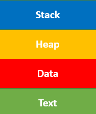
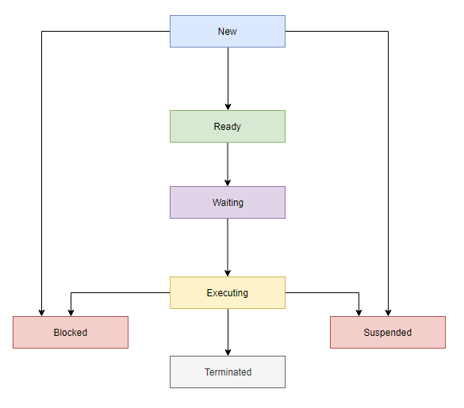
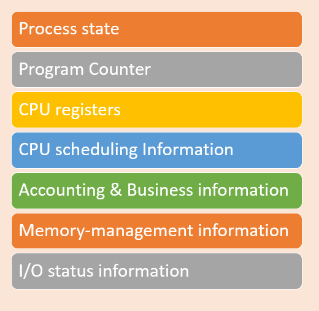

# **Process**

## **Vậy Process là gì?**

Những "công việc" mà hệ điều hành thực hiện gọi là `process`, dù tên gọi của chúng khác nhau tùy vào cấu trúc hệ điều hành (batch system hay time-shared system).

Nhắc lại về định nghĩa, một `process` là một chương trình đang được *thực thi* trên hệ điều hành (tức là chương trình đó đang chạy, đã được tải lên bộ nhớ chính để hoạt động, cụ thể là ram). Nhưng, một chương trình không phải là một `process`. Vì chương trình là một `executable file`, hay một `folder` nằm trên máy.

> `executable file`: Tập tin *thực thi*, là một tập tin chứa các đoạn mã, một tập hợp các hướng dẫn bộ xử lý (*processor instructions*) được lưu lại trên máy tính. Khi các đoạn mã được tải lên bộ nhớ chính và được *thực thi*  bởi bộ xử lý nó trở thành một process.  
> ***execute***: thực thi là thuật ngữ mô tả quá trình chạy chương trình phần mềm máy tính, tập lệnh hoặc lệnh. 
> ***processor, central processor, or microprocessor or CPU***: là bộ xử lý trung tâm của máy tính. CPU của máy tính xử lý tất cả các hướng dẫn mà nó nhận được từ phần cứng và phần mềm chạy trên máy tính. Ví dụ: CPU đã xử lý các hướng dẫn sử dụng trình duyệt web để mở và hiển thị trang web này trên máy tính của bạn.

## **Cấu trúc của Process**

Đây, là sơ đồ kiến trúc của **Process**

- **Stack:** lưu trữ dữ liệu tạm thời được dùng trong thời gian rất ngắn hoặc dùng một lần như các tham số của hàm, returns addresses và biến cục bộ.

- **Heap:** Cấp phát bộ nhớ, bộ nhớ này có thể được xử lý trong thời gian chạy của nó.

- **Data:** Chứa các biến global (biến dùng chung ở cấp toàn bộ chương trình) và static (loại biến dùng chung ở cấp struct).

- **Text:** Bao gồm hoạt động hiện tại được biểu thị bằng giá trị của [Program Counter](#process-control-block-pcb) và nội dung của các thanh ghi trên vi xử lý.

> Địa chỉ trả về (`returns addresses`) là vị trí ngay sau khi chương trình con được gọi. Nghĩa là, khi một câu lệnh `return` được gọi trong chương trình con hoặc chương trình con hoàn thành, chương trình chính sẽ đi đến địa chỉ trả về và tiếp tục chạy chương trình.  
> Một `routine` hoặc chương trình con (`subroutine`), còn được gọi là `hàm`, `procedure`, `phương thức` và chương trình con (`subprogram`), là code được gọi và thực thi ở bất kỳ đâu trong chương trình.

## **Trạng thái của Process**

**Trạng thái của Process (Process States)** là một điều kiện của process tại một thời điểm cụ thể. Nó cũng xác định vị trí hiện tại của quá trình.

**Một Process có 7 trạng thái, gồm:**

- **New:** trạng thái khi một tiến trình được tạo hoặc được khởi động lần đầu tiên.

- **Ready:** Ở trạng thái sẵn sàng, process sẽ được tải vào bộ nhớ chính, sẵn sàng để thực thi. Thường thì khi một tiến trình vẫn đang chạy, CPU sẽ không cho phép một tiến trình khác xen vào mà sẽ phải đợi tới lượt để đảm bảo tiến trình hiện tại đã xử lý xong (lưu ý, tiến trình xử lý xong không có nghĩa là nó sẽ kết thúc).

- **Waiting:** là trạng thái Process đang chờ để được CPU phân bổ thời gian và các tài nguyên khác để thực thi.

- **Executing:** Process là trạng thái thực thi.

- **Blocked:** khoảng thời gian khi một quá trình đang bị chặn lại và chờ một sự kiện nào đó xảy ra, ví dụ như chờ thao tác I/O (Nhập/Xuất) hoàn tất.

- **Suspended:** là khoảng thời gian khi một process đã sẵn sàng để thực thi nhưng chưa được HĐH đưa vào hàng đợi sẵn sàng.

- **Terminated:** xảy ra khi một tiến trình đã xử lý xong hoặc bị ngắt bởi yêu cầu từ hệ thống hoặc người dùng, trạng thái này cũng có thể được gọi là Exit.

Sau khi hoàn thành mỗi bước, tất cả các tài nguyên và bộ nhớ được sử dụng bởi một process được giải phóng.

## **Process Control Block (PCB)**

Để lưu dữ liệu hoạt động của các tiến trình, hệ điều hành sẽ sử dụng một cấu trúc dữ liệu gọi là `Process Control Block` (PCB). Mỗi PCB được xác định bởi một số nguyên dương (bắt đầu từ 1), gọi là Process ID (PID). PCB thường sẽ bao gồm các thông tin như sau:

- **Process state:** Trạng thái hiện tại của tiến trình (là một trong các trạng thái ở phần trên)

- **Program counter:**  chứa địa chỉ (hay trong ngôn ngữ lập trình C, ta gọi nó là con trỏ/pointer) đến lệnh cần thực thi tiếp theo.

- **Thanh ghi CPU:** Các thanh ghi tiến trình cần sử dụng để thực thi.

- **Thông tin định thời CPU:** Thành phần này bao gồm mức độ ưu tiên của process, quy định process nào thì thực thi trước.

- **Accounting and business information:** Chứa các thông tin về việc sử dụng CPU như thời gian sử dụng phần mềm, số công việc hoặc process, v.v.

- **Memory-management information:** Thông tin này bao gồm giá trị của các thanh ghi cơ sở và giới hạn, trang hoặc bảng phân đoạn. Điều này phụ thuộc vào hệ thống bộ nhớ, được sử dụng bởi hệ điều hành.

- **I/O status information:** Thông tin về các thiết bị đọc - ghi mà tiến trình cần sử dụng.
