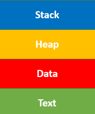
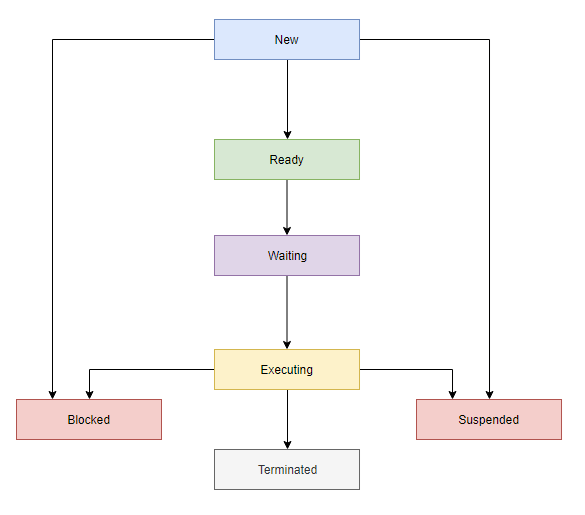

# **Process Management**

## **Vậy Process là gì?**

**Process** là việc thực thi (execution) một chương trình để thực hiện các hành động được chỉ định. Hệ điều hành giúp bạn tạo, lên lịch và chấm dứt các process được sử dụng bởi CPU. Process được tạo bởi process chính được gọi là process con.

Các hoạt động của process có thể được kiểm soát dễ dàng với sự trợ giúp của PCB (Khối điều khiển process). Có thể coi nó như bộ não của process, nơi chứa tất cả các thông tin quan trọng liên quan đến xử lý như process id, priority, state, CPU register, v.v.

## **Vậy Process Management là gì?**

**Process management** liên quan đến các nhiệm vụ khác nhau như tạo, lập lịch trình, chấm dứt process và khóa chết (creation, scheduling, termination of processes, dead lock). **Process** là một chương trình đang được thực thi, đây là một phần quan trọng của các hệ điều hành hiện đại. HĐH phải phân bổ tài nguyên cho phép các process chia sẻ và trao đổi thông tin. Nó cũng bảo vệ tài nguyên của từng process khỏi các phương thức khác và cho phép đồng bộ hóa giữa các process.

Công việc của HĐH là quản lý tất cả các process đang chạy của hệ thống. Nó xử lý các hoạt động bằng cách thực hiện các tác vụ như lập lịch process và chẳng hạn như phân bổ tài nguyên.

## **Cấu trúc của Process**

Đây, là sơ đồ kiến trúc của **Process**

- **Stack:** lưu trữ dữ liệu tạm thời được dùng trong thời gian rất ngắn hoặc dùng một lần như các tham số của hàm, returns addresses và biến cục bộ.

- **Heap:** Cấp phát bộ nhớ, bộ nhớ này có thể được xử lý trong thời gian chạy của nó.

- **Data:** Chứa các biến global (biến dùng chung ở cấp toàn bộ chương trình) và static (loại biến dùng chung ở cấp struct).

- **Text:** Bao gồm hoạt động hiện tại được biểu thị bằng giá trị của `Program Counter` và nội dung của các thanh ghi trên vi xử lý:

## **Process States**

**Process States** là một điều kiện của process tại một thời điểm cụ thể. Nó cũng xác định vị trí hiện tại của quá trình.

**Một Process có 7 trạng thái, gồm:**

- **New:** trạng thái khi một tiến trình được tạo hoặc được khởi động lần đầu tiên.

- **Ready:** Ở trạng thái sẵn sàng, process sẽ được tải vào bộ nhớ chính, sẵn sàng để thực thi. Thường thì khi một tiến trình vẫn đang chạy, CPU sẽ không cho phép một tiến trình khác xen vào mà sẽ phải đợi tới lượt để đảm bảo tiến trình hiện tại đã xử lý xong (lưu ý, tiến trình xử lý xong không có nghĩa là nó sẽ kết thúc).

- **Waiting:** là trạng thái Process đang chờ để được CPU phân bổ thời gian và các tài nguyên khác để thực thi.

- **Executing:** Process là trạng thái thực thi.

- **Blocked:** khoảng thời gian khi một quá trình đang bị chặn lại và chờ một sự kiện nào đó xảy ra, ví dụ như chờ thao tác I/O (Nhập/Xuất) hoàn tất.

- **Suspended:** là khoảng thời gian khi một process đã sẵn sàng để thực thi nhưng chưa được HĐH đưa vào hàng đợi sẵn sàng.

- **Terminated:** xảy ra khi một tiến trình đã xử lý xong hoặc bị ngắt bởi yêu cầu từ hệ thống hoặc người dùng, trạng thái này cũng có thể được gọi là Exit.

Sau khi hoàn thành mỗi bước, tất cả các tài nguyên và bộ nhớ được sử dụng bởi một process được giải phóng.

## **Process Control Block (PCB)**

Để lưu dữ liệu hoạt động của các tiến trình, hệ điều hành sẽ sử dụng một cấu trúc dữ liệu gọi là `Process Control Block` (PCB). Mỗi PCB được xác định bởi một số nguyên dương (bắt đầu từ 1), gọi là Process ID (PID). PCB thường sẽ bao gồm các thông tin như sau:

- **Process state:** Trạng thái hiện tại của tiến trình (là một trong các trạng thái ở phần trên)

- **Program counter:** Con trỏ lưu địa chỉ của chỉ dẫn tiếp theo giúp cho tiến trình thực thi (là một phép tính hoặc tương tự).

- **CPU registers:** Các thanh ghi tiến trình cần sử dụng để thực thi.

- **CPU scheduling information:** Thành phần này bao gồm mức độ ưu tiên của process, bao gồm con trỏ dùng để lập lịch hàng đợi (scheduling queues) và nhiều tham số lập lịch khác.

- **Accounting and business information:** Chứa các thông tin về việc sử dụng CPU như thời gian sử dụng phần mềm, số công việc hoặc process, v.v.

- **Memory-management information:** Thông tin này bao gồm giá trị của các thanh ghi cơ sở và giới hạn, trang hoặc bảng phân đoạn. Điều này phụ thuộc vào hệ thống bộ nhớ, được sử dụng bởi hệ điều hành.

- **I/O status information:** Thông tin về các thiết bị đọc - ghi mà tiến trình cần sử dụng.
