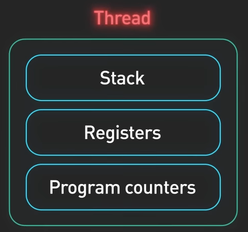
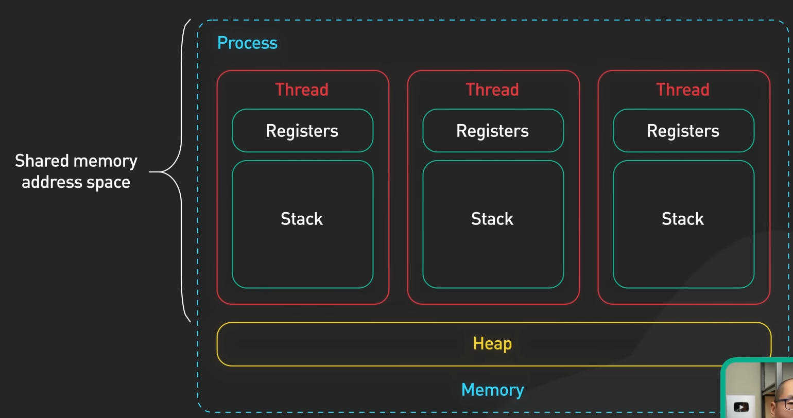
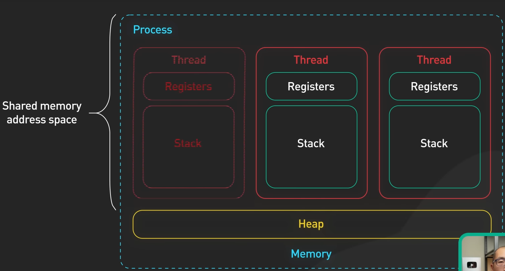
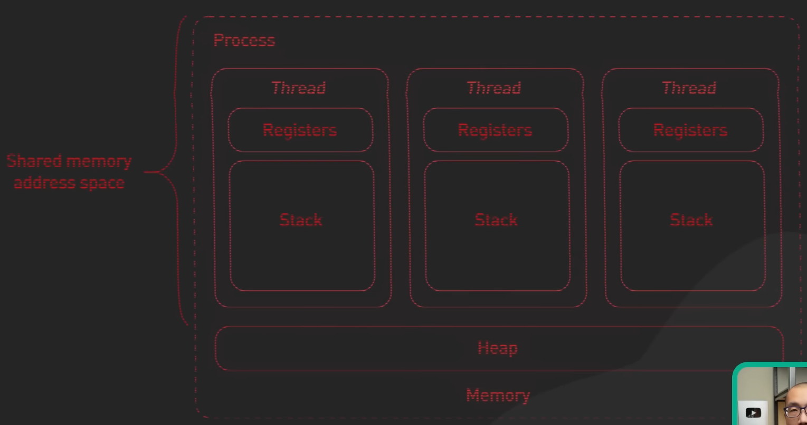

# **Thread**

`Thread` hay luồng là một đơn vị thực thi của `process`. Một process có ít nhất một thread, được gọi là `main thread`, và có thể có nhiều thread phụ.

Như đã nêu ở trong phần `process` các thành phần `stack`, `registers` và `program counters` là một phần của process, nhưng chính xác hơn thì những thành phần này thuộc về một thread.

Các thread cùng chia sẻ bộ nhớ với nhau gọi là bộ nhớ heap, giúp các thead khác có thể giao tiếp với nhau.

  

Tuy nhiên, nếu như một thread gặp vấn đề khi xử lý tác vụ.

Nó sẽ gây anh hưởng cho toàn bộ các thread còn lại, khiến một process sẽ bị lỗi và phải dừng lại.

